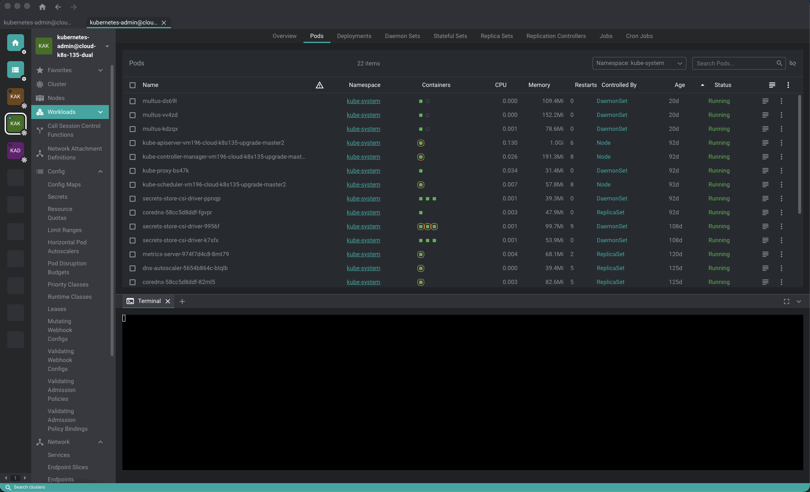

# IMS-Scope

<!-- markdownlint-disable MD013 -->

[](https://github.com/Nibamot/ims-scope)
[](https://github.com/Nibamot/ims-scope?tab=MIT-1-ov-file#readme)
[](https://github.com/Nibamot/ims-scope/releases/latest)

<!-- markdownlint-enable MD013 -->

IMS-Scope is a Kubernetes IDE for managing and monitoring clusters, built as
a fork of [Freelens](https://freelens.app) — Freelens is the major
inspiration and does all the heavy lifting here. This fork adds a small,
growing set of features on top of it, added incrementally as they come up
from real use: requests, feedback, and bugs hit along the way. There is no
fixed roadmap; it grows as needs do.



## Requirements

Kubernetes 1.22 or later. Older clusters fall back to the bundled `kubectl`,
which may not work correctly; a different one can be set in Preferences.

## Downloads

See the [releases](https://github.com/Nibamot/ims-scope/releases) page and
download the right package for your system.

### macOS

macOS 12 or later is required.

Download either the PKG (installer) or DMG (image) package from the
[releases](https://github.com/Nibamot/ims-scope/releases) page. Both arm64
(M1 chip or newer) and amd64 (Intel) variants are available.

These builds are not signed and notarized with an Apple Developer
certificate, so Gatekeeper will refuse to open them with a "damaged" or
"unidentified developer" warning. Either right-click the app and choose
**Open** to approve it once, or clear the quarantine attribute from the
terminal:

```sh
xattr -cr /Applications/IMS-Scope.app
```

### Linux

Linux with GNU C Library 2.34 or later is required. It is provided ie. by
Debian 12, Fedora 35, Mint 21, openSUSE Leap 15.4, Ubuntu 22.04 and by
rolling release distributions like Arch, Manjaro or Tumbleweed.

Download DEB or RPM (package) or AppImage (executable) from the
[releases](https://github.com/Nibamot/ims-scope/releases) page. Both arm64
(aarch64) and amd64 (x86_64) variants are available.

#### AppImage

The Linux AppImage file requires libz.so and libfuse.so.2. You can add them
by running:

```sh
sudo apt install libfuse2 zlib1g-dev
```

Run the application with additional arguments:

<!-- markdownlint-disable MD013 -->
```sh
./IMS-Scope*.AppImage --no-sandbox --ozone-platform-hint=auto --enable-features=WebRTCPipeWireCapturer --enable-features=WaylandWindowDecorations --disable-gpu-compositing
```
<!-- markdownlint-enable MD013 -->

#### DEB/RPM

The DEB/RPM postinstall script sets the `chrome-sandbox` binary to setuid
root, which Chromium's sandbox requires to work without `--no-sandbox`. If the
app installs but the desktop launcher does nothing when clicked (running the
binary directly from a terminal works fine), the setuid bit likely didn't get
applied. Check it and fix it manually if needed:

```sh
ls -l /opt/IMS-Scope/chrome-sandbox
# expected: -rwsr-xr-x ... (note the "s")

sudo chmod 4755 /opt/IMS-Scope/chrome-sandbox
sudo chown root:root /opt/IMS-Scope/chrome-sandbox
```

### Windows

Windows 10 or later is required.

Download the EXE (NSIS) or MSI installers from the
[releases](https://github.com/Nibamot/ims-scope/releases) page.

Both the x64 (amd64) and arm64 versions of the Windows binaries are provided.
However, an EXE installer (NSIS) itself is x86 binary only even if it installs
arm64 application and then installs to `C:\Program Files (x86)\IMS-Scope` path
by default.

Windows binaries are code-signed, but Microsoft Defender SmartScreen may still
show a "Windows protected your PC" warning until the signing certificate
builds up reputation. Click **More info**, then **Run anyway** to proceed.

#### Portable

Download the Portable EXE from the
[releases](https://github.com/Nibamot/ims-scope/releases) page. It is a
self-contained executable that can be run without installation.

## Development

Visit the [Development](DEVELOPMENT.md) document to see how to build the
application from source. Since this is a fork of Freelens, the
[Freelens Docs](https://freelensapp.github.io/docs/) are also a useful
reference for the underlying architecture and extension system.

## License

This repository is a fork of [Freelens](https://github.com/freelensapp/freelens),
itself a fork of [Open Lens](https://github.com/lensapp/lens/tree/master), the
core of [Lens Desktop](https://k8slens.dev).

Copyright (c) 2024-2026 Freelens Authors.

Copyright (c) 2022 OpenLens Authors.

Copyright (c) 2026 IMS-Scope Authors.

[MIT License](https://opensource.org/licenses/MIT)
